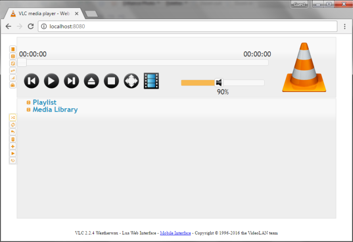
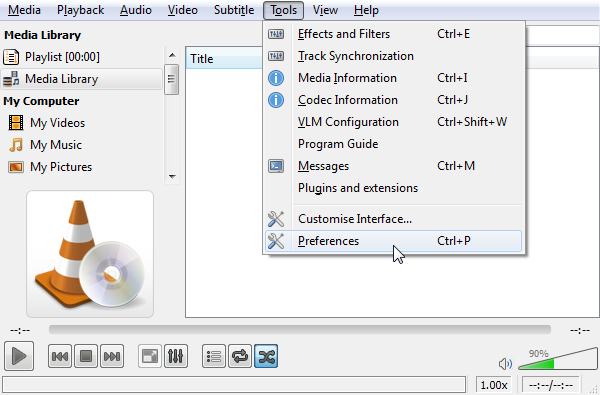
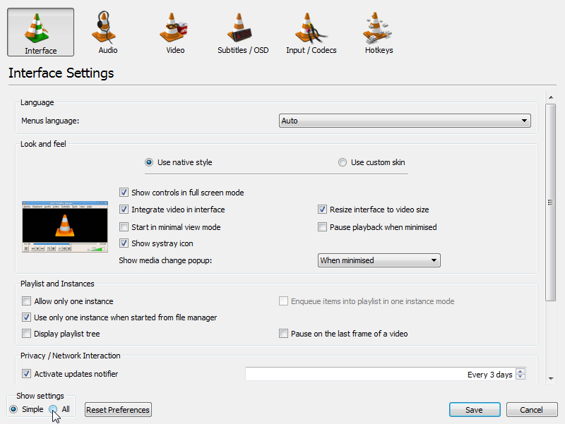
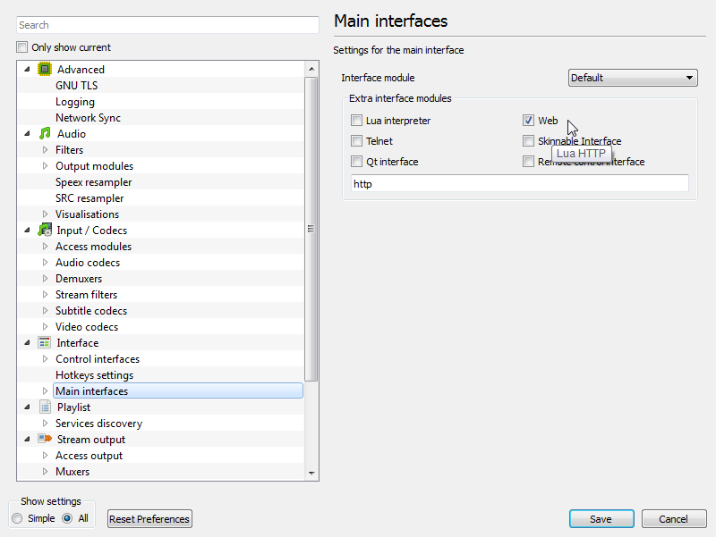
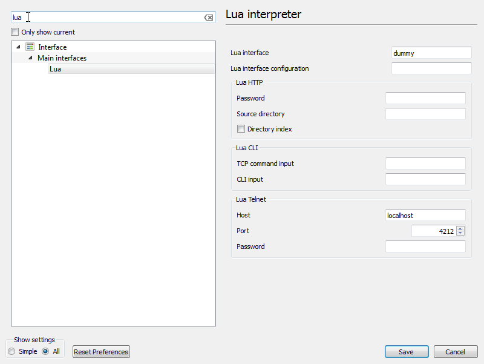
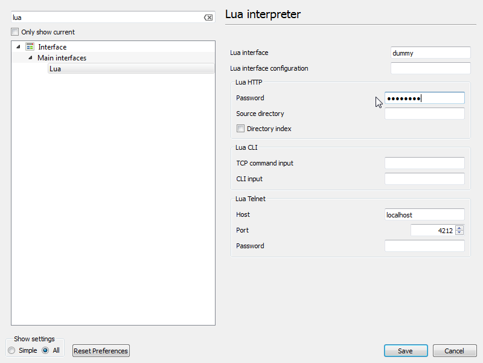
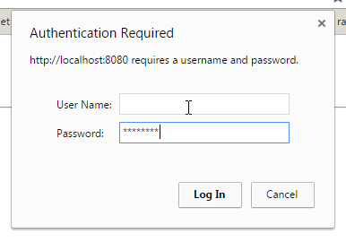

# How to activate VLC's web interface
Did you know that VLC has a web interface? 

Well, it does! **\o/** (..._from v2.0_)

And with it you can control the player remotely, say via a web browser, with your phone, or even from your programming language of choice.

The thing is that it's not enabled by default, but activating it is really simple.

As I said you'll need at least version 2.0 of VLC installed. Then to activate the interface follow these steps:

 **1.** open VLC

 **2.** go to `Tools->Preferences`

>   

 **3.** show `All` settings

>  

 **4.** select `Main interfaces` on the left, and tick the `Web` checkbox on the right

>  

**5.** **Done!**

To check that it is working just open a browser and point it to [http://localhost:8080](http://localhost:8080).

You should see the web interface.

# Troubleshooting

If you get an authorization error, or are prompted for a login (as could be the case for VLC versions above 2.1), just:

 **1.** search for `lua` in VLC preferences dialog

>   

 **2.** and set a password for `Lua HTTP` there

>   

 **3.** reopen `localhost:8080` in your browser and insert the password when asked, **but remember to leave the `User Name` field blank!**

>   

# References

 - [https://www.howtogeek.com/117261/how-to-activate-vlcs-web-interface-control-vlc-from-a-browser-use-any-smartphone-as-a-remote/](https://www.howtogeek.com/117261/how-to-activate-vlcs-web-interface-control-vlc-from-a-browser-use-any-smartphone-as-a-remote/)
 - [https://wiki.videolan.org/documentation:modules/http_intf/](https://wiki.videolan.org/documentation:modules/http_intf/)
 - [https://wiki.videolan.org/VLC_HTTP_requests/](https://wiki.videolan.org/VLC_HTTP_requests/)
 
 